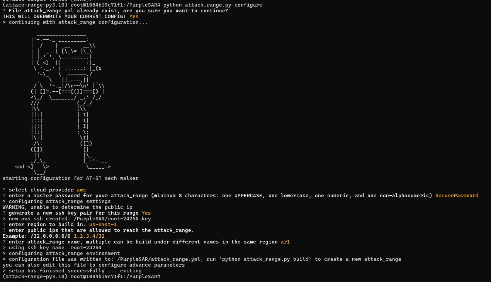

# Deployment guide

## Run Docker container

```bash
docker run -it mihhailsokolov/purplesar
```

## Copy Splunk Enterprise Security into the container (in a separate window)

1. Get container ID

```bash
docker ps 
```

2. Copy ES SPL file into `/PurpleSAR/apps/` inside the container

```bash
docker cp .\splunk-enterprise-security_732.spl <CONTAINER_ID>:/PurpleSAR/apps/
```

## Configure AWS credentials

1. Set the  API Key ID
2. Set the Secret Key
3. Set region to `us-east-1`
4. Keep output format empty

```bash
aws configure
```

## Configure attack range deployment

```bash
python attack_range.py configure
```



## Start the deployment

```bash
python attack_range.py build
```

## Put `billh` credentials on `ITSERVER`

1. Once the deployment is done, go to Guacamole and login into `DC`
2. RDP into `ITSERVER` - `10.0.1.15` as `billh`
   - Username: `ATTACKRANGE\billh`
   - Password: `PurpleSAR2024!`
3. Disconnect (NOT Sign Out) from the RDP sessions
